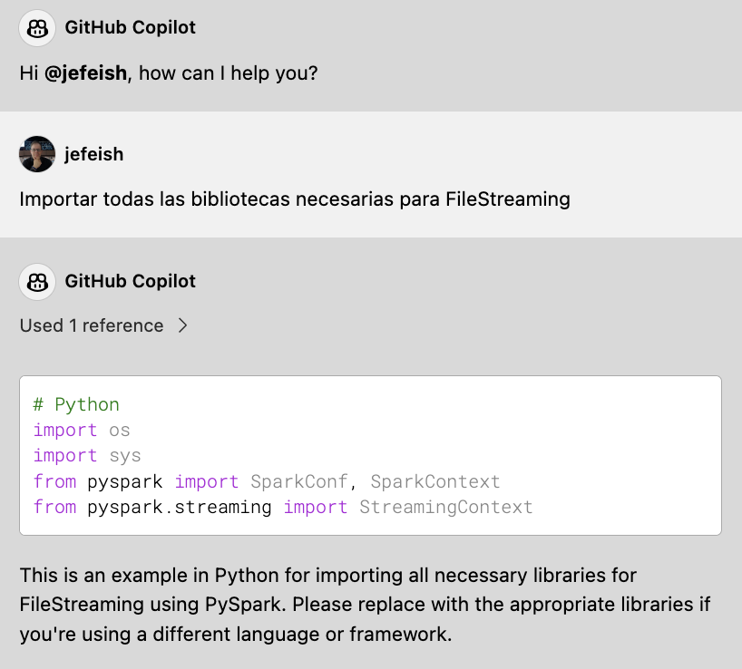
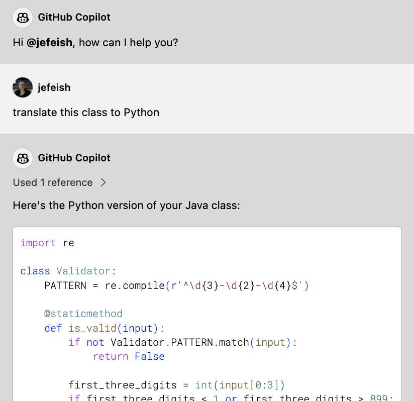

 (:clock10: 5 min)

## Copilot Chat is Multilingual

Copilot Chat can understand numerous natural languages alongside programming languages.


### :pencil2: Exercise 1: Use the language of your choice to talk to Copilot Chat

- Test Copilots Multilingual features. 

    For this exercise we don't require any pre-set files from the Repo.

  - Choose any language and instruct Copilot Chat to create code. For example, 
    - Choose any coding-language you prefer

    - **Spanish:**

      ```
      Importar todas las bibliotecas necesarias para FileStreaming
      ```

    - **German:**

      ```
      Importiere alle erforderlichen Bibliotheken für FileStreaming
      ```

  - Sample Output

      

    > **Note:**
    >  - Without specifying a programming language and with no open code file as a reference, Copilot Chat will pick a language.
    >  - Copilot Chat might continue to use the language in the request in its generated code


### :pencil2: Exercise 2: Use Copilot Chat to translate your code to another programming language

- Example - Java to Python
  - Open the [`Validator.java`](../sample-code/Validator.java) class in your IDE  (Tab) and ask in **Copilot Chat**,

    ```
    translate this class to Python
    ```

   - Sample output

      

  

   - **Note:** Copy the generated code into your IDE

     


