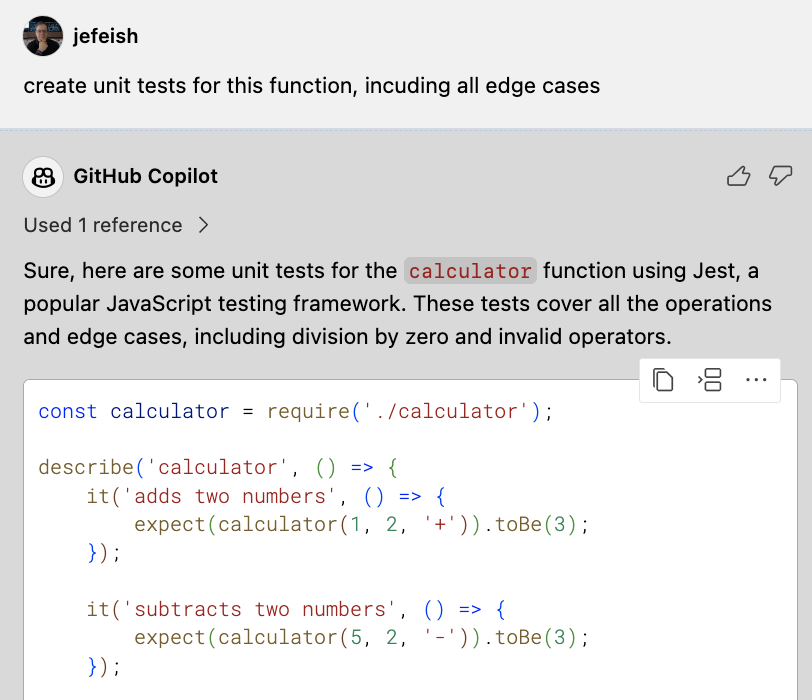

( :clock10: 5 min )

## Copilot Chat for Unit-Tests

Use **Copilot Chat** to generate Unit-Tests for your code

### :pencil2: Exercise 1: Generate Unit-Tests for the [`calculator.js`](../Node-calculator/solution/calculator.js) function

- Open the  [`calculator.js`](../Node-calculator/solution/calculator.js) file in your IDE (Tab)

- With the `calculator.js` file open in a Tab, go to **Copilot Chat** and request Copilot to create Unit-Tests.

  - Sample **(Zero-Shot Prompt approach)**

     


- Try this exercise again with a more specific request.

    - Example **(Few-Shot Prompt approach)**
        ```
        create unit tests for this function, incuding all edge cases using the Mocha framework
        ```

- **Note:** Remember to use **`Prompt crafting`** to provide additional details/context, what kind of `Unit-Tests` you would like Copilot to create etc.


- Try this exercise again using a **`Copilot Chat command`**

  ```
  /tests
  ```


- Import the results into a new file and run the tests. If you need to know how to run the tests, ask Copilot Chat.

     


