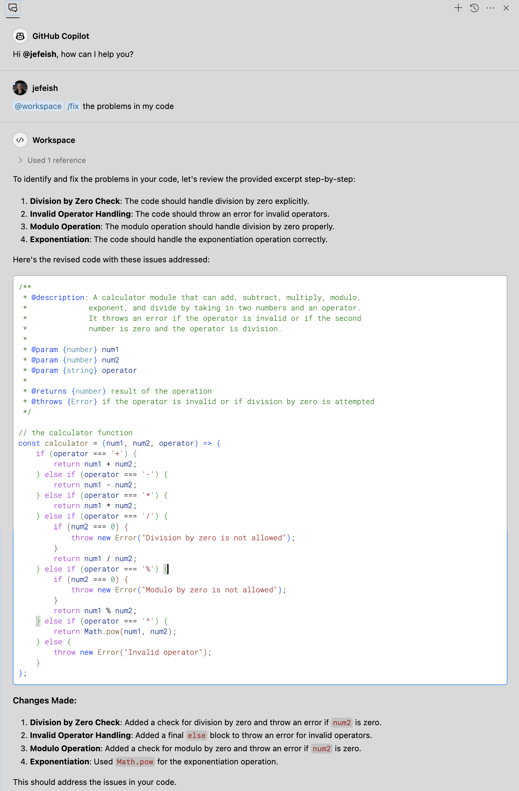

( :clock10: 5 min )

## Copilot Chat - Fixing Code


### :pencil2: Exercise 1: Use `Copilot Chat` to fix your code

- Open the  [`calculator-bug.js`](../sample_code/calculator-bug.js) file and ask **Copilot Chat** to 'fix' the code

    ```
    @workspace /fix the problems in my code
    ```

  - Sample

    

#### Some additional steps

1. Try this with other (your own) code samples
  
2. Explore the option to highlight (select) a segement from the code and try to only fix that, for example `Regular Expressions`.
  
    

- **Note:** You can import the fixed code into the original code base

     


