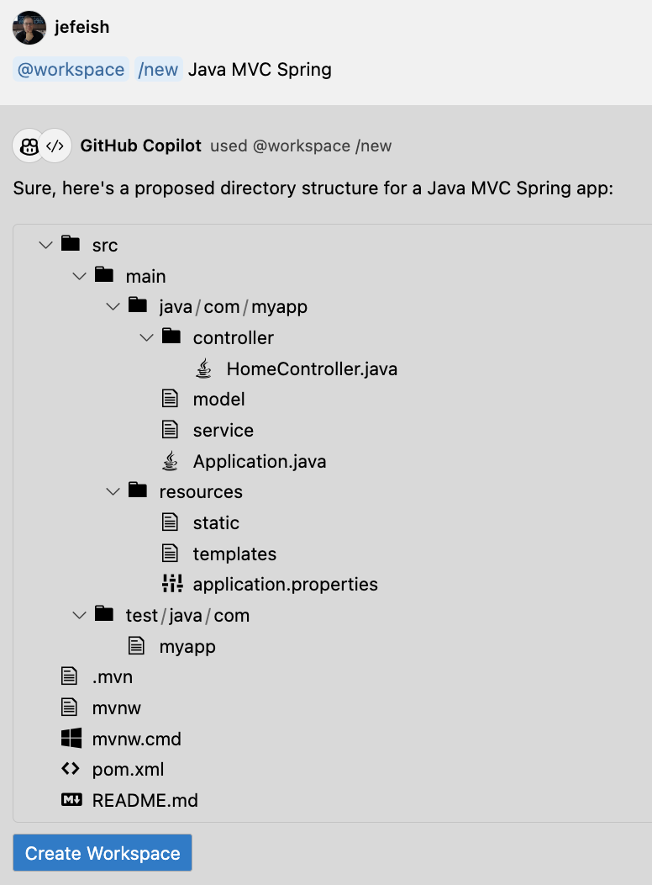

( :clock10: 10 min )

## Copilot Chat - Working at a Project Level


### :pencil2: Exercise 1: Ask **`Copilot Chat`** to help you to work with programming frameworks.

- In **Copilot Chat** ask for help creating a React App.

    ```
    How do I create a REACT App that uses Bootstrap
    ```

    - Sample

      
  
    

  - **Note:** You can copy and past any of the provided commands into the `Terminal` for execution


### :pencil2: Exercise 2: Use **`Copilot Chat - @workspace`** to help you to create a project

  - **Note:** Use the commands `help` function to see all the available options
    
      ```
      /help
      ``` 
    
    

- Try the following command in **Copilot Chat**
  ```
  @workspace /new Java MVC Spring
  ```

  - Sample
    
    

  - Review the suggestion and if you agree, `Click` **Create Workspace**

  

- Try other Frameworks and see what `Copilot Chat` provides


