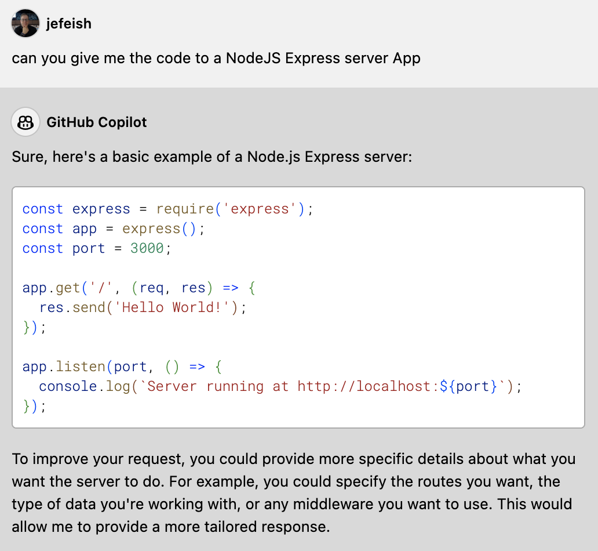

( :clock10: 5 min )

## Copilot Chat - Role Prompting

Copilot Chat can embody a role within the context

### :pencil2: Exercise 1: Tell **Copilot Chat** to assume a specific Role

- Give **Copilot Chat** instructions about the expected Role. 

    Use the sample text:

    ```
    act as a mentor and after every request tell me how I could improve it
    ```

    - Sample

      

  

- Ask **Copilot Chat** to help you with some code

    ```
    can you give me the code to a NodeJS Express server App
    ```
    - Sample

      

  

- Review the generated suggestion and check how **Copilot Chat** handles its 'new' Role


