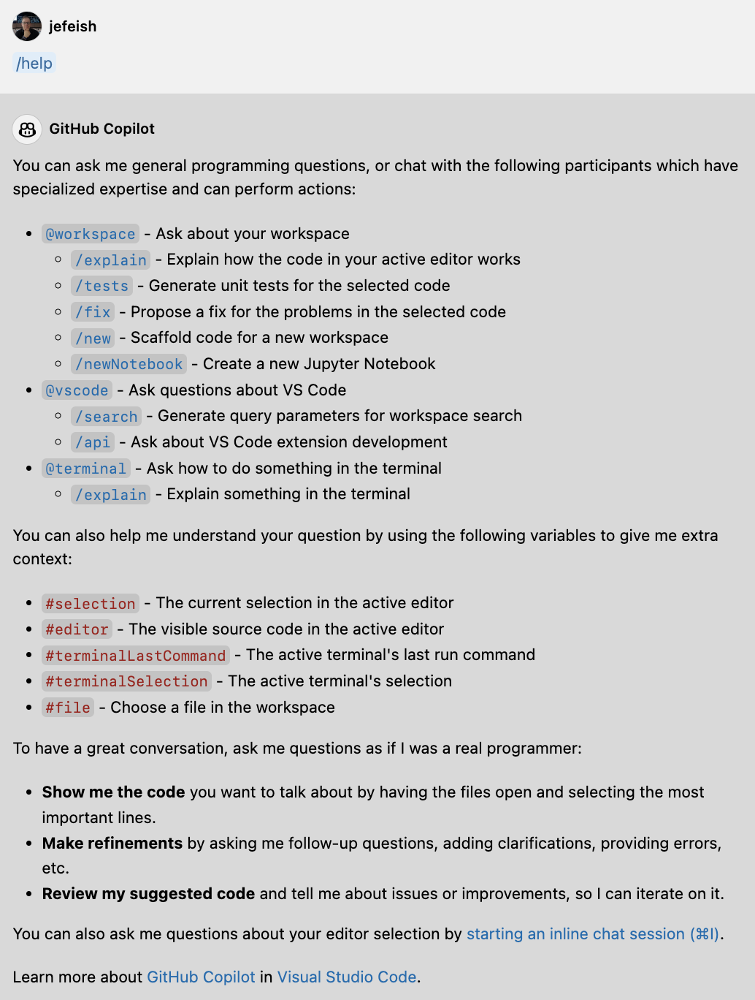
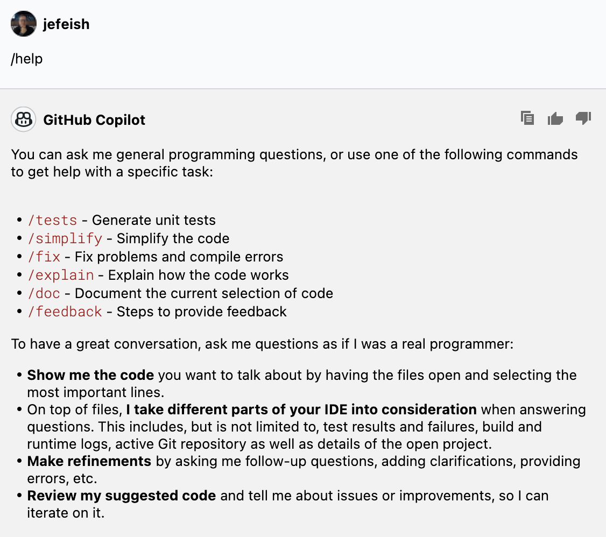

( :clock10: 5 min )

## Copilot Chat - Working with Commands


### :pencil2: Exercise 1: Explore the `Copilot Chat commands`

- Type `/help` in **Copilot Chat** 
  ```
  /help
  ```

  - Sample output

    |VS Code|IntelliJ IDEA|
    |---|---|
    |||

- Have a look at the available **Copilot Chat** `command` options

  - **Note:** At the time of writing, there is no features parity for the IDE's.


### Exercise 2: Running some of the commands and see how Copilot Chat repsonds


- For Example: Use the `#file` command (VS-Code)
  - Copilot Chat reflects on the code/file content in your currently open Tab, you can add additional content by adding a file to your current Copilot Chat session and have it being included in the Prompt context.


