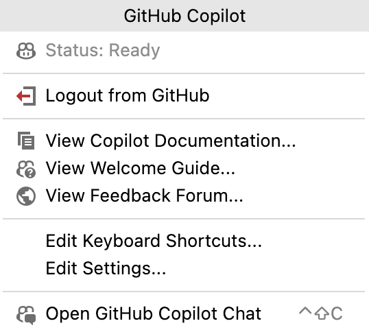
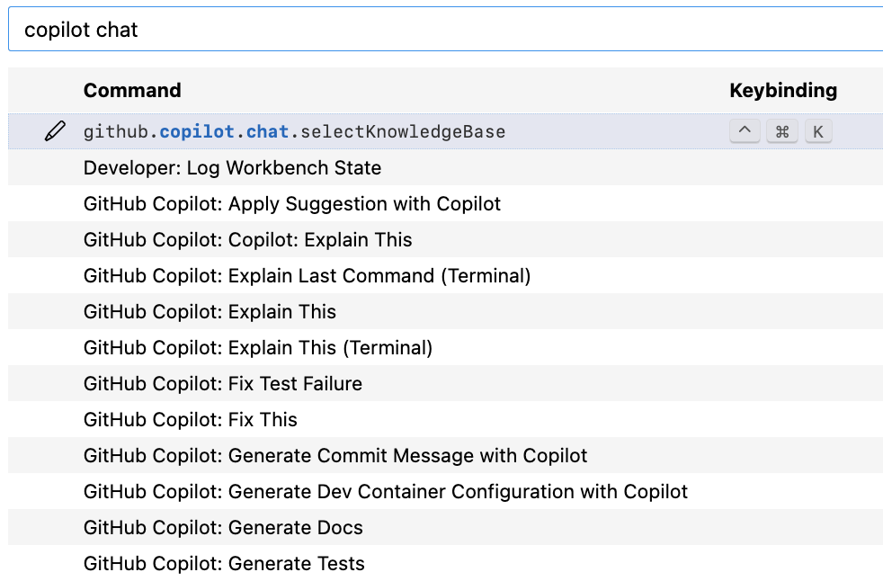

(🕙 5 min)

## Copilot Chat - Configure your IDE

**Goal:** Optimize the Copilot Chat interaction in your IDE

### :pencil2: Exercise 1: Configure Plugin Shortcuts

- Open the Copilot Chat Plugin Configuration

    |VS Code|IntelliJ IDEA|
    |---|---|
    |`Click` the  icon on the lower right side of your IDE|Go to ` Menu` -> `Tools` -> `GitHub Copilot`   or  `Click` the  icon on the lower right side of your IDE|
    |||

- Select `Edit Keyboard Shortcuts`

    (VS-Code)
  

- Assign a shortcut to a command. For example: `/explain`
  

- After creating that shortcut, open any file in the IDE, highlight a line of code and use the shortcut to have Copilot explain it to you.
  - For Example: Open the [`MysteryFunction.java`](../demos/document-code/MysteryFunction.java) file and use the `/explain` command in **Copilot Chat**

- Repeat that step for any other **Copilot Chat** command you like

### :pencil2: Exercise 2: Configure Plugin Settings

- Open the IDE setting for Copilot Chat

    |VS Code|IntelliJ IDEA|
    |---|---|
    |`Click` the  icon on the lower right side of your IDE|Go to ` Menu` -> `Tools` -> `GitHub Copilot`   or  `Click` the  icon on the lower right side of your IDE|
    |||

- Select `Edit Settings`

    |VS Code|IntelliJ IDEA|
    |---|---|
    |||

- Explore the available `Copilot Chat` settings
  - Note: The setting options might differ based on your IDE

