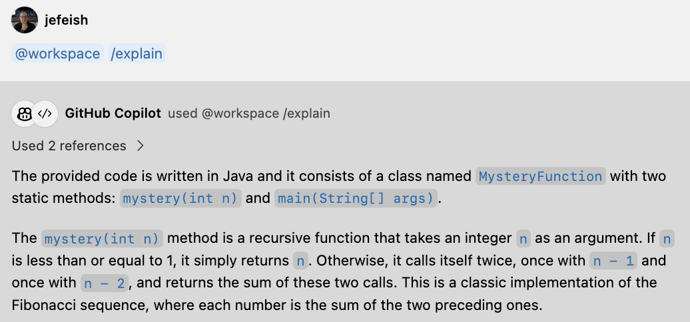
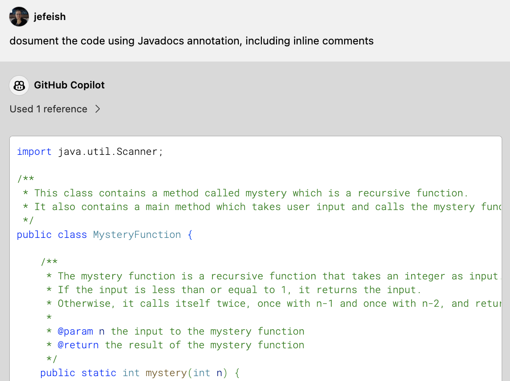

 (:clock10: 5 min)

## Copilot Chat - Explain & Document Code

### :pencil2: Exercise 1: Ask **Copilot Chat** to explain the code

- Open [`MysteryFunction.java`](../demos/document-code/MysteryFunction.java) (Tab). 

  Request an explanation in **Copilot Chat**

  ```
  @workspace /explain 
  ```

  - Sample

    


### :pencil2: Exercise 2: Ask **Copilot Chat** to document the code

- Open [`MysteryFunction.java`](../demos/document-code/MysteryFunction.java) (Tab). 

  Ask **Copilot Chat** to document the code

  ```
  document the code using Javadocs annotation, including inline comments
  ```

  - Sample

    


- **Note:** Copy the generated code into your IDE

    

