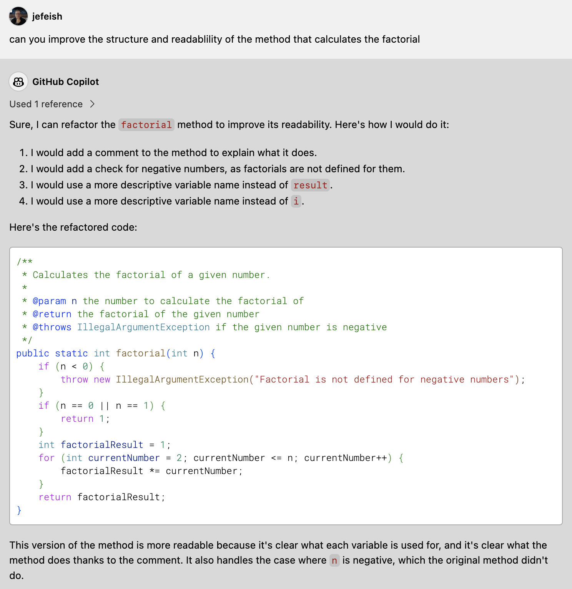

 (:clock10: 5 min)

## Copilot Chat - Refactoring Code


### :pencil2: Exercise 1: Use `Copilot Chat` to refactor your code, for many languages

- Open the  [`FactorialCalculator.java`](../demos/sample-code/FactorialCalculator.java) file and ask **Copilot Chat** to 'improve' the code

    ```
    can you improve the structure and readability of the method that calculates the factorial
    ```

  - Sample
    

  

- **Note:** Copy the generated code into your IDE

     

