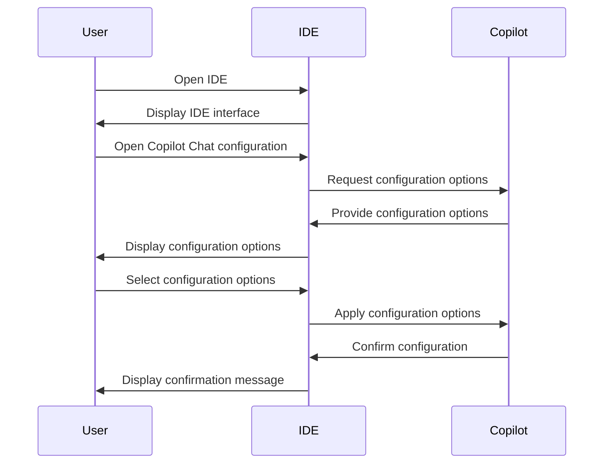

```mermaid
sequenceDiagram
    participant User
    participant IDE
    participant Copilot

    User->>IDE: Open IDE
    IDE->>User: Display IDE interface
    User->>IDE: Open Copilot Chat configuration
    IDE->>Copilot: Request configuration options
    Copilot->>IDE: Provide configuration options
    IDE->>User: Display configuration options
    User->>IDE: Select configuration options
    IDE->>Copilot: Apply configuration options
    Copilot->>IDE: Confirm configuration
    IDE->>User: Display confirmation message
```