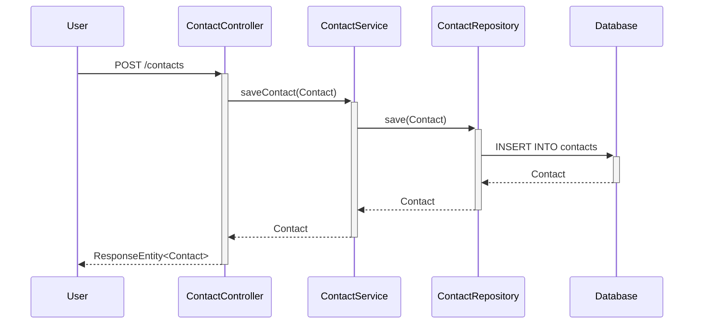

```mermaid
sequenceDiagram
    participant User
    participant ContactController
    participant ContactService
    participant ContactRepository
    participant Database

    User->>+ContactController: POST /contacts
    ContactController->>+ContactService: saveContact(Contact)
    ContactService->>+ContactRepository: save(Contact)
    ContactRepository->>+Database: INSERT INTO contacts
    Database-->>-ContactRepository: Contact
    ContactRepository-->>-ContactService: Contact
    ContactService-->>-ContactController: Contact
    ContactController-->>-User: ResponseEntity<Contact>
```
