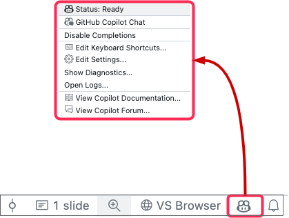

# Copilot Fundamentals - Training Exercises


##  Getting Started

>*Prompt engineering is the process of designing and creating high-quality prompts that can be used to generate accurate and useful code suggestions with Copilot.*

**GitHub**

---

### :pencil2: Copilot First Steps (🕙 5 min)

- **Description:**

- **Configurations**
  - Check the configuration options of your Copilot Plugin

    

  - Check the Copilot keyboard shortcuts in your IDE. A link to them should be listed in the config options.
    - Specifically have a look at the Keyboard shortcut for the `Copilot Suggestions Tab`

- **Copilot Suggestions**

  - Use `Inline help`
    - Open a code file in your IDE (eg.: [phoneNumberValidator.py](/demos/copilot-operations/phoneNumberValidator.py))
    - Start typing a comment, to tell Copilot what you want it to do
    - **Example:**

      ```python
      # function to validate phone numbers and to return a true or false value
      ```
      > Hit return to 'trigger' Copilot Suggestions

  - Use the `Suggestions Tab`
    - The default shortcut for VS-Code is: `control` + `enter`
    - IntelliJ Jetbrains does not have shortcut defined by default, please create one.

- **Repository Link:** Inside the `/copilot-fundamentals-training` Repo open, [/demos/copilot-operations/phoneNumberValidator.py](/demos/copilot-operations/phoneNumberValidator.py)


---

<br><br>
##  Prompt Techniques


---

### :pencil2: Prompt Techniques & Neighboring Tabs  (🕙 5 min)

- **Description**: Practice Zero-Shot, One-Shot prompting etc.

- **Repository Link:** Inside the `/copilot-fundamentals-training` Repo open, [/demos/copilot-prompt-engineering-1.md](/demos/copilot-prompt-engineering-1.md)

---

### :pencil2: Think step by step (:clock10: 10 min)


- **Description**: Create a NodeJS calculator, with the help of Copilot

  - Open the `/demos/Node-Calculator/README.md`

  - **Follow the instructions in that file.**
    - The ':arrow_forward: Help' sections provide solution examples, click them to expand.
    ...

- **Repository Link:** Inside the `/copilot-fundamentals-training` Repo open, [/demos/Node-Calculator/README.md](/demos/Node-Calculator/README.md)

---


##  Tips & Techniques
---

### :pencil2: Copilot Mulitlingual Features (:clock10: 5 min)

- **Description**: Test Copilots Multilingual features. For this exercise we don't require any pre-set files from the Repo, simply open a new file in your IDE and follo the instructions below.


  - Choose any language and instruct Copilot to create code. For example import statements, functions etc.
    - Choose any coding-language you prefer

    - **Spanish:**

    ```
    // Importar todas las bibliotecas 
    // necesarias para FileStreaming
    ```

    - **German:**

    ```
    // Importiere alle erforderlichen 
    // Bibliotheken für FileStreaming
    ```

  - **Optional:** Create a class that provides greetings or form labels in multiple languages
Choose any coding-language you prefer
Try non-ASCII character sets 
(eg.: Chinese, Hebrew, ...)


- **Repository Link:** None, simply use a new file in your IDE


---

### :pencil2: Offering Alternatives (:clock10: 5 min)

#### If at first you don’t succeed, try again

- **Description**
  - Create a NEW file in your IDE, with a description comment

  - :warning: **NOTE:** The file extension you choose determines the code language that Copilot provides suggestions for!


    **For example:** `myfunction.js` will tell Copilot to use Javascript/Node as the suggestion language.

    - Use this sample
    ```node
    // @description This function sorts numbers based on a given order.
    ```

  - Have a look what Copilot suggests

  - Modify the “description comment”, for example provide more details and check the provided suggestions again

- **Repository Link:** None, simply use a new file in your IDE

---

### :pencil2: Use Copilot to Understand / Explain Code (:clock10: 5 min)

- **Description**
  
  - Open the [/demos/document-code/README.md](/demos/document-code/README.md) file and follow the instructions

  - Remember to "ask Copilot at every level”
    - Class
    - Method / Function
    - Single instruction


- **Repository Link:** Inside the `/copilot-fundamentals-training` Repo open, [/demos/document-code/README.md](/demos/document-code/README.md)

---


