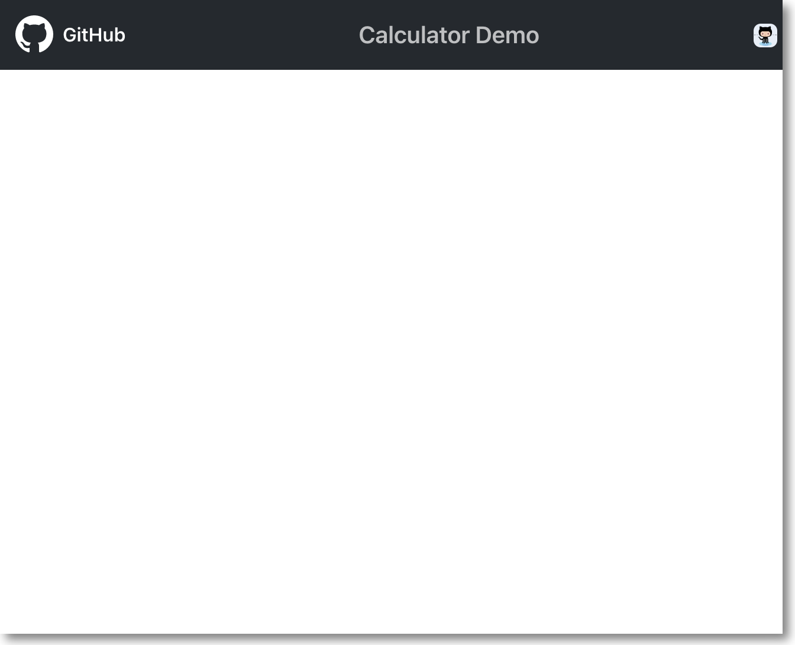
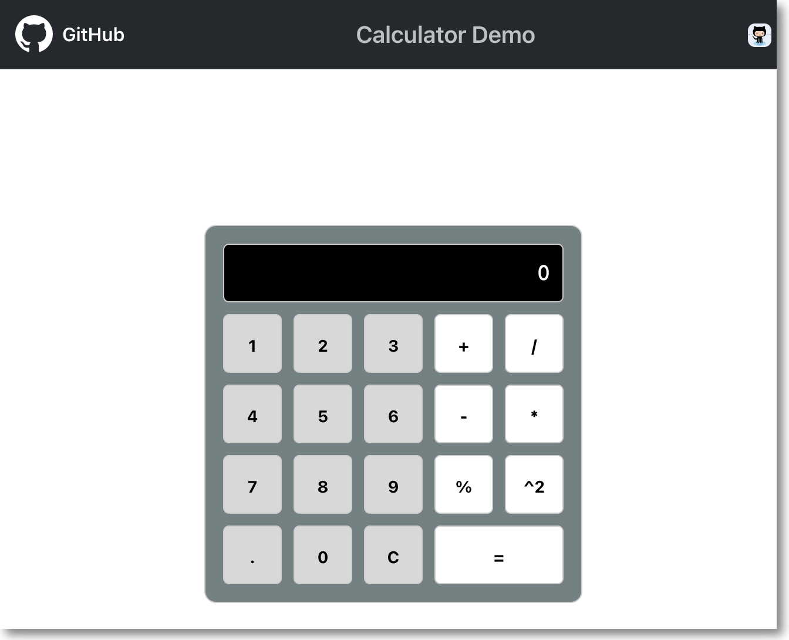
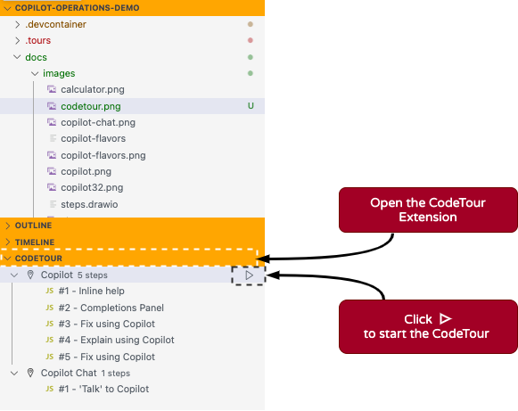
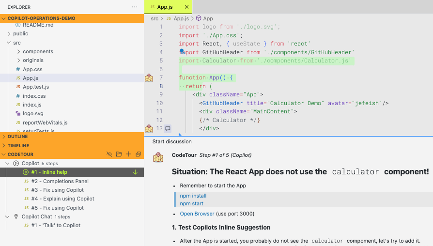

     


# Copilot Operations Demo

## Introduction

### :warning: Note: The primary objective of this demo Repository is not to complete all the exercises such as the calculator app; that aspect serves as a guide for walking you through the exercise steps. If you don't achieve the exact results by the end, that's perfectly fine! What matters most is that you gain insight into how to use Copilot effectively.

## Overview

Our goal is to **acquaint you with Copilot's functionalities** and demonstrate diverse ways to interact effectively with Copilot.

Copilot and Copilot Chat, while built on the same backend technology, serve distinct roles within your integrated development environment (IDE). To put it simply, **Copilot functions as a coding assistant**, responding to your in-code context, while **Copilot Chat operates as your research assistant**, enabling chat-based communication for more interactive collaboration with Copilot.

As this exercise leverages Copilot for code suggestions, please note that Copilot's responses may vary depending on the context. We welcome this variability, as it showcases the dynamic capabilities of Copilot.

For effective interaction with Copilot, it's essential to keep in mind that **Copilot benefits from your guidance and supervision!**
 
 To use copilot's own words,

 
***"I’m powered by AI, so surprises and mistakes are possible. Make sure to verify any generated code or suggestions, and share feedback so that we can learn and improve."***

---
## We Offer 2 Examples 

### [REACT Calculator App](#react-calculator)
### [Node Calculator App](demos/Node-calculator/README.md)

---

These are demonstrations for utilizing GitHub Copilot within Visual Studio Code. This demo highlights essential features of the Copilot extension for the benefit of class attendees.

We employ the [CodeTour](https://marketplace.visualstudio.com/items?itemName=vsls-contrib.codetour) extension to guide you through an example of a React Calculator App. 

## Prerequisites & Options

Here are some options and requirements on how to run this demo.
> **Note:** we are using VS-Code

### Option 1: [GitHub Codespaces](https://github.com/features/codespaces)

We recommend to run this via [GitHub Codespaces](https://github.com/features/codespaces). We provide a [Devcontainer](https://code.visualstudio.com/docs/devcontainers/containers) configuration that provides all the required IDE components (VS Code).

### Option 2: VS Code + [Devcontainers](https://code.visualstudio.com/docs/devcontainers/containers)

If you don't want to use Codespaces, just clone this Repo and use a local [Devcontainer](https://code.visualstudio.com/docs/devcontainers/containers) in your VS-Code IDE.

### Option 3: VS Code + CodeTour extension (Local)

If you want to run this Demo on your local platform (no Codespaces, no Devcontainers), please have look a at the required tools.

**Here are some requirements you'll need:**
- NodeJS: v19.7.0
- NPM: v9.5.0
- VSCode Extensions:
  - [Copilot](https://marketplace.visualstudio.com/items?itemName=GitHub.copilot)
  - [Copilot Chat](https://marketplace.visualstudio.com/items?itemName=GitHub.copilot-chat)
  - [CodeTour](https://marketplace.visualstudio.com/items?itemName=vsls-contrib.codetour)

---

## REACT-Calculator

## Before you Start the Tour

We provide you with several **Code Tour** exercises, to practice Copilot interactions. The first step is to setup/start the `calculator` app.

---

### Start the `Calculator` App

```bash
npm install
npm start
``` 

- Open a browser window (http://localhost:3000), to see the App.

> **Note:** At the start of the CodeTour your browser should not show the calculator, yet, adding this is part of the Demo. This is what you should see...



> **Note:** By the time the Demo is completed, the App should look like this...

 

---

## :warning: TO RUN THE TOUR 'MANUALLY', PLEASE REFER TO [COPILOT-OPERATIONS.MD](./copilot-operations.md)

---

## Start the tour ...

Here is a screenshot of what the CodeTour extension looks like in the IDE (VS-Code).



By **clicking the 'play' button**, CodeTour will open a code Tab (App.js) showing the first CodeTour steps...


---

### Note: These are exercise items that should be addressed in the Demo

|Copilot|Copilot Chat|
|---|---|
|Inline help|Say Hello|
|Open the Completions Panel|Check its limits|
|Fix using Copilot|Test its knowledge|
|Explain using Copilot|Topics ‘/’|


